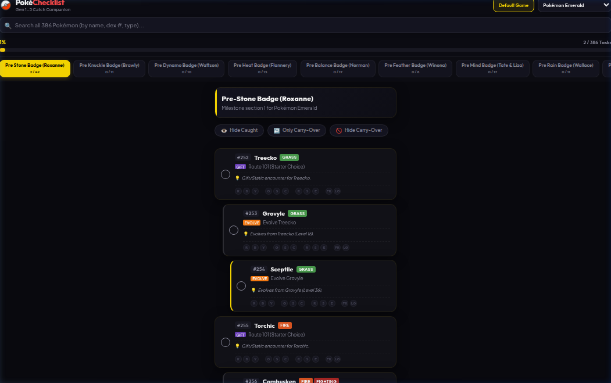

# PokéChecklist

A catch and evolution tracker for Generation 1 through 3 Pokémon games, starting with Pokémon Yellow. The application tracks catch requirements, evolutionary stages, location details, and method conditions across games.

## Screenshot


## Features

- **Game Checklists**: Support for Gen 1 (Red, Blue, Yellow), Gen 2 (Gold, Silver, Crystal), and Gen 3 (Ruby, Sapphire, Emerald, FireRed, LeafGreen).
- **Global Search**: Real-time search across all 386 Pokémon, detailing location requirements and caught ownership status across all games.
- **Interactive Tracking**: Mark requirements as completed to automatically synchronize caught status.
- **Inter-Game Trades**: Transfer caught status between games through a modal swap interface.
- **Automatic Database Seeding**: Generates and seeds requirements and progress tracking records on server initialization.

## Architecture

The project is structured as a web application backed by a Node.js Express server and a SQLite database.

- **Frontend**: Single HTML page (`public/index.html`) styled with custom CSS (`public/styles.css`) and driven by vanilla JavaScript (`public/app.js`).
- **Backend**: Express server (`server.js`) exposing APIs for game details, section navigation, caught status updates, trading, and global search.
- **Database**: SQLite3 database (`pokemon_checklist.db`) containing tables for games, sections, pokemon, requirements, progress, and caught_pokemon.

## Setup and Installation

### Prerequisites

- Node.js (version 20 or higher)
- Docker and Docker Compose (optional, for containerized execution)

### Local Development

1. Install the application dependencies:
   ```bash
   npm install
   ```

2. Start the development server:
   ```bash
   npm start
   ```

   The server will run on `http://localhost:3000` by default.

### Docker Deployment

To run the application inside a Docker container mapped to port 8876:

1. Build and launch the container in the background:
   ```bash
   docker compose up --build -d
   ```

   The application will be accessible at `http://localhost:8876`.

2. To stop the container:
   ```bash
   docker compose down
   ```

The database file `pokemon_checklist.db` is volume-mounted to the host machine to preserve caught checklist progress across container rebuilds.

## Automated Testing

An automated test suite is provided to verify database integrity, progress tracking, and swap/trade logic.

To run the test suite:
```bash
npm test
```
or
```bash
node test.js
```

The test runner initializes an isolated temporary SQLite database, executes individual suite assertions, prints a structured terminal summary, and cleans up the test database file upon completion.
